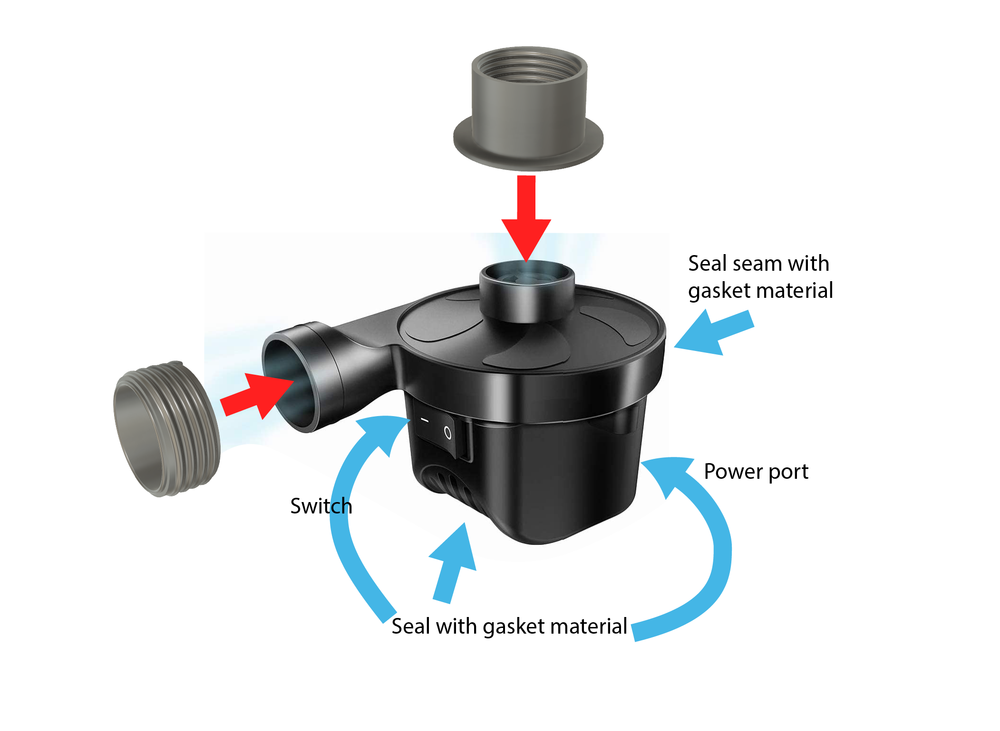

# Air Pump PAPR Blower

## Materials
* Air Pump, one of the following: 
	* [ONG NAMO Electric Air Pump](https://www.amazon.com/gp/product/B07PHSXD1B/ref=ox_sc_act_title_2) - Preferred
	* [Electric Air Pump](https://www.amazon.com/gp/product/B083LYCB4H/ref=crt_ewc_title_dp_1) - Preferred
	* [LotFancy Electric Air Pump](https://www.amazon.com/gp/product/B013UQ0T2Y/ref=crt_ewc_title_dp_2)
* Hot Glue
* Gasket material, one of the following:
	* Rubber sheet
	* Neoprene foam sheet

## Caveat Emptor
* Air pumps are not made to be airtight. A PAPR system must be made airtight to prevent unmanaged particulate ingress.
* It is recommended that the air pumps can be disassembled. We want to be able to seal the air pump from the inside.
* Manufacturer warns that prolonged usage of the air pump may cause the unit to overheat (they caution to run the pump for a max of 20 minutes). And the air vents are intended to help dissapate heat
	* However, I've successfully ran the pump for approximately 1.5hrs with the vents sealed. It seems to be ok.
	* Please be aware of possible overheating issue.

## TODO:
* Battery pack design
* Cable lock design - Use to keep power cable locked to prevent accidental disconnects
* [Airflow Meter / Indicator](https://www.3m.com/3M/en_US/company-us/all-3m-products/~/3M-Versaflo-Air-Flow-Indicator-TR-971-for-TR-600-PAPR-1-EA/) - Used to verify the CFM meets requirements

## Instructions

1. Disassemble Air Pump (if possible)
2. Seal all areas of ingress with hot glue.
	* Possible areas of ingress:
		* Vents
		* Power socket / power cable mating point to the chassis
		* Switch
		* Seam where parts of the chassis mate
		* Screw holes
	* **NOTE**: you may want to reserve sealing the seam for after pressure testing the rest of your seals **OR** construct a gasket for the chassis seam instead of attempting to seal it with hot glue.
	* **NOTE**: For air pumps where they cannot be taken apart, you will have to seal from the outside.
		* This would require sealing the power switch permanently to the on position.
3. Attach the [40mm inlet](./files/Inlet.stl) and [40mm outlet](./files/Outlet.stl) to the appropriate areas of the air pump.
	* **NOTE**: Most air pumps are designed such that the outlet is along the seam of the chassis. That means that once you install the 40mm outlet component, you cannot take the pump apart without removing the 40mm outlet. 
4. Perform a pressure test using [40mm Female Valve Cap](../../../Components/files/40mm\ Female\ Valve\ Cap.stl), [40mm Male Cap](../../../Components/files/40mm\ Male\ Cap.stl)